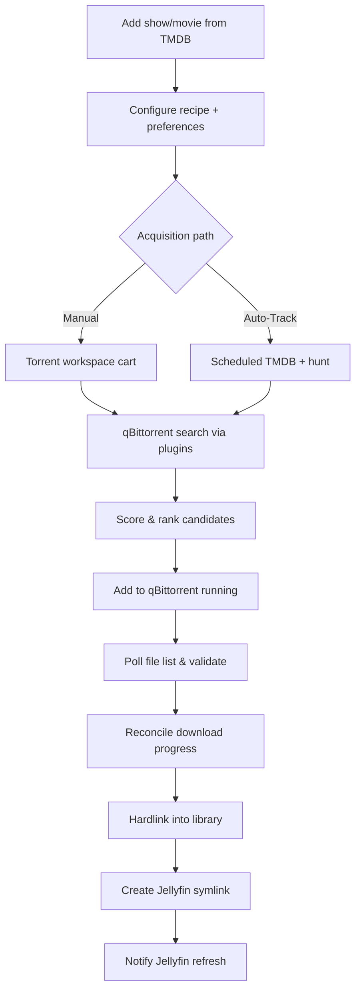

# Media Manager — Application Overview

## Purpose

Media Manager is a **Windows desktop application** that acts as a personal media operations hub. It bridges the gap between torrent acquisition (qBittorrent), library organization (hardlinks + NFO files), and media server presentation (Jellyfin symlinks). Users track TV shows and movies from TMDB, configure how torrents are searched and ranked, automate weekly episode discovery and download, and maintain a clean library layout without duplicating file data.

The app targets a **single-user, self-hosted** workflow on Windows 10+ with NTFS hardlinks and optional administrator privileges for symlinks.

---

## High-Level Workflow

---

## Application Shell

### Main Window (`MainWindow.xaml`)

Borderless WPF window with custom chrome:

- **Title bar:** drag, minimize, maximize, close
- **Workspace area:** hosts the active view via `ContentControl` + `ViewTemplates.xaml`
- **Right sidebar:** seven workspace navigation buttons (collapsible 260px ↔ 72px)
- **Status bar:** job progress, drive storage pills, qBittorrent / WARP / Jellyfin / Google Drive status

### Workspaces

| Workspace | Enum | Default startup | Purpose |
|-----------|------|-----------------|---------|
| News | `AppWorkspaceKind.News` | **Yes** | Dashboard of new episodes and tracked show status |
| Auto | `AutoTrack` | | Manual Auto-Track control and per-show monitoring |
| Find/Add | `FindAdd` | | TMDB search and library import |
| Library | `Library` | | Full library browser, linking, import, metadata |
| Torrent | `Torrent` | | Torrent cart acquisition pipeline |
| Recipe | `Recipe` | | Search recipe editor |
| System Settings | `SystemSettings` | | All configuration |

**Code:** `ViewModels/MainViewModel.cs`, `Resources/ViewTemplates.xaml`

---

## Startup & Background Services

On launch (`App.xaml.cs`):

1. **Single-instance mutex** — second instance shows message and exits
2. **Settings load** — `settings.json` from state folder
3. **Database init** — SQLite schema create/migrate
4. **Background services start:**
   - `LogCleanupService` — periodic old log deletion
   - `SymlinkCoordinatorService` — startup symlink sync
   - `AutoTrackSchedulerService` — TMDB discovery, torrent hunt, reconcile timers
   - `BackupSchedulerService` — daily + event-driven Google Drive backup
5. **Windows notifications** initialized
6. **Poster cache warmup** — background TMDB poster fetch
7. **Tray icon** — if Start Minimized or Close to Tray enabled

On exit: schedulers, symlink coordinator, Jellyfin refresh, log cleanup, and tray disposed.

### Tray & Lifecycle

- **Close to tray:** closing hides window; tray icon restores or quits
- **Start minimized:** launches hidden in tray
- **Background mode:** status polling pauses when minimized without tray; resumes on restore
- **Toast activation:** launching from notification can open hidden window

**Code:** `MainWindow.xaml.cs`, `Services/TrayIconService.cs`, `Services/AppLifecycleService.cs`

---

## Core Domain Concepts

### Tracked Media

- **TrackedShows** — TMDB TV series with seasons, episodes, recipes, auto-track settings, watch status
- **TrackedMovies** — TMDB movies with availability, torrent state, recipes
- **TrackedSeasons** — per-season management: episode mode vs pack mode, download folder, pack torrent
- **TrackedEpisodes** — episode metadata, availability, selected torrent candidate, download state

### Source Items & Linking

- **SourceItems** — files discovered in configured source/download folders via scanner + parser
- **Hardlinks** — NTFS hardlinks from source files into `MediaManagerLibrary` per drive
- **Symlinks** — optional unified Jellyfin root (`SymlinkSettings.UnifiedRoot`) pointing at hardlinked files
- **NFO files** — Kodi-style sidecars written for Jellyfin metadata

### Torrent Cart

- **TorrentCartOrders** — acquisition jobs (episode, season pack, movie) with status lifecycle
- **TorrentCartOrderCandidates** — ranked search results per order
- Orders flow: Draft → Searching → CandidateSelected → Adding → Downloading → Completed (or Failed/Canceled)

### Recipes

JSON files (`*.rcp`) in `{StateFolder}/Recipes/` defining torrent search behavior through six pipeline modules: Identity → QueryBuilder → SearchSource → CandidateParser → CandidateFilter → Scoring.

See [RECIPE_SCHEMA.md](./RECIPE_SCHEMA.md) for the full schema and live examples.

**Code:** `Services/RecipeService.cs`, `Models/SearchRecipe.cs`

### Auto-Track Pipeline

Three concurrent phases (each mutex-guarded):

1. **TMDB Discovery** — refresh tracked shows, detect new aired episodes, enforce daily TMDB budget
2. **Torrent Hunt** — search qBittorrent for pending episodes, create cart orders, add torrents (with WARP if needed)
3. **Background Reconcile** — sync qBittorrent state, hardlink completed downloads, trigger pack linking

Scheduler respects weekly anchor (day + time), per-show overrides, and hunt intervals.

**Code:** `Services/AutoTrackService.cs`, `Services/AutoTrackSchedulerService.cs`

---

## External Integrations

### qBittorrent

- WebUI API client for search, add, pause/resume, file list, torrent state
- Search plugins resolved from recipe configuration
- Optional **process restart** when WebUI bind fails
- Embedded **WebViewerWindow** for manual qBittorrent access
- Categories: separate TV show and movie categories

### Jellyfin

- REST API for connection test and path update notifications
- **Library refresh service** debounces path notifications after symlinks
- Optional **WARP hold** during refresh window; log tailer for early disconnect
- Embedded WebViewer for Jellyfin UI

### TMDB

- Show/movie search, details, episode lists, poster/still images
- Episode organization schemes ( airing order vs DVD, etc.)
- Metadata sync jobs for library refresh

### Google Gemini

- AI-assisted **special episode mapping** for season packs (OVAs, specials)
- Optional confirmation dialog before applying AI mappings
- Daily quota tracking and model catalog on disk

### Cloudflare WARP

- CLI lease/connect/disconnect for SSL recovery during hunts
- Status pill in main window and embedded viewers
- Confirm before disconnect during active Auto-Track

### Google Drive Backup

- OAuth **Desktop client** JSON (`credentials.json` or browsed path); tokens cached under `{StateFolder}/GoogleDrive/token/`
- Scope: `DriveFile` (per-file access). Interactive connect only from Settings; background jobs use silent refresh
- Zip backup: database snapshot, settings (redacted secrets), recipes, manifest with checksums
- Daily schedule + event-driven debounced backup after DB changes
- Restore from backup history in settings

See [STATE_FOLDER.md](./STATE_FOLDER.md#google-drive-oauth) for credential format and setup steps.

---

## Data Storage

### State Folder (default `D:\MediaManagerState`)

Full layout documented in [STATE_FOLDER.md](./STATE_FOLDER.md). Summary:

| File/Folder | Contents |
|-------------|----------|
| `settings.json` | All app configuration |
| `media-manager.db` | SQLite database |
| `logs/` | Rotating application logs |
| `posters/` | Cached TMDB poster/still images |
| `Recipes/` | Torrent search recipe JSON (`.rcp`) |
| `GoogleDrive/` | OAuth credentials + token cache |
| `gemini-*.json` | Gemini models, quota, mapping cache |

### Database Tables (10)

`SourceItems`, `SeriesMappings`, `TrackedShows`, `TrackedSeasons`, `TrackedEpisodes`, `TrackedMovies`, `FetchJobs`, `TorrentCartOrders`, `TorrentCartOrderCandidates`, `TorrentBlacklist`

Schema is versioned via `SchemaMigrations` (`MigrationRunner` + numbered SQL). `DatabaseService` still runs `CREATE TABLE IF NOT EXISTS` + `EnsureColumn` as a safety net. **`TrackedEpisodes`** stores personal `UserRating` / `Thought` (migration `004_episode_rating_thought`) in addition to TMDB `VoteAverage`. **`FetchJobs`** is legacy; search state lives in `TorrentCartOrders` and in-memory caches.

See [FEATURES.md](./FEATURES.md) for column details.

**Code:** `Services/DatabaseService.cs`

---

## Security & Safety Features

### Torrent Content Validation

Before resuming a paused torrent add:

1. Add torrent **paused**
2. Fetch file list from qBittorrent
3. Check extensions against allowed media + dangerous extension lists
4. Detect extension obfuscation
5. Resume or blacklist + remove on failure

**Code:** `Services/TorrentAddGateService.cs`, `Services/TorrentContentValidationService.cs`

### Torrent Blacklist

Rejected listings/hashes stored per show with reason and suspicious file JSON. Soft-delete via `IsActive`.

### Shell Launch Guard

Prevents duplicate external process launches.

---

## Logging & Diagnostics

- **AppLogger** — file, UI, and console targets with rotation
- **ConsoleLogWindow** — dark terminal-style viewer (bottom bar button)
- **OperationProgressService** — global job status in status bar
- **CartCandidateDebugSession** — debug logging for candidate evaluation
- **SearchEngineDiagnostics** — search plugin diagnostics

---

## UI Theming

- Light/Dark themes via `ThemeService` and `AppThemeColors.*.xaml`
- Material Design + WPF-UI + Lucide icon pack
- Workspace UI state persisted in `UiSettings` (sort, filters, selected media)

---

## Dependency Injection

All services registered as singletons in `App.ConfigureServices()`. ViewModels for each workspace are singletons; `MainViewModel` orchestrates navigation and status polling.

Key packages: CommunityToolkit.Mvvm, Microsoft.Data.Sqlite, Microsoft.Web.WebView2, Google.Apis.Drive, Microsoft.Toolkit.Uwp.Notifications.

---

## Build & Deploy

- Target: `net8.0-windows10.0.17763.0`, x64
- Single-file self-contained publish with app icon
- Sonarr.Parser third-party project for filename parsing
- Build: MSBuild x64 (Platform=x64)
