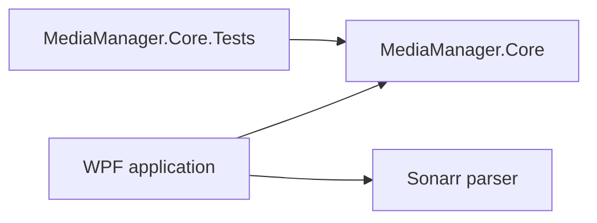
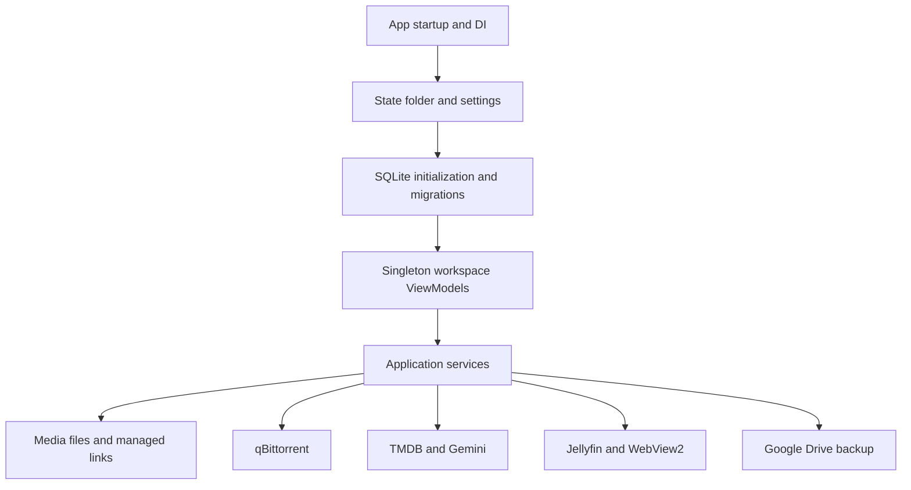

# Architecture and Trust Boundaries

## Project graph

- `media management app.csproj`: .NET 8 Windows WPF executable with x64
  self-contained publishing.
- `MediaManager.Core`: domain algorithms and embedded SQLite migrations.
- `MediaManager.Core.Tests`: xUnit coverage for Core behavior.
- `ThirdParty/Sonarr.Parser`: separately built vendored parser.

## Runtime flow

`App.xaml.cs` is the composition root. It loads settings, initializes SQLite,
creates the main shell, and starts background coordinators. Most services and
all workspace ViewModels are process-lifetime singletons.

## State and database boundary

The selected state folder contains `settings.json`, `media-manager.db`, logs,
recipes, posters, WebView2 data, and backup authorization material.
`SettingsService` owns JSON load/save and the state-folder pointer.
`DatabaseService` is the main persistence implementation and opens SQLite
connections per operation. `MigrationRunner` applies embedded numbered
migrations before runtime table and column compatibility checks.

Review focus:

- concurrent UI and background writers;
- migration and runtime-schema convergence;
- backup snapshot and restore consistency;
- whole-file settings writes from multiple components.

## Filesystem boundary

The application scans download roots, creates hardlinks into per-drive library
roots, creates symlinks into the Jellyfin root, writes NFO files, reconciles
missing sources, and supports unlink and cleanup operations. The executable
requests administrator privileges.

Primary controls include `LibraryPathResolver`, `HardlinkService`,
`AutoTorrentLinkService`, `Services/Symlink`, library management, media import,
and source reconciliation.

Review focus:

- source and destination root containment;
- delete and unlink identity checks;
- database and filesystem operation ordering;
- partial-failure recovery;
- pack cleanup isolation.

## Torrent and unattended automation boundary

Recipes and tracked-media settings drive search, candidate scoring, content
validation, qBittorrent addition and removal, blacklist state, pack linking,
and scheduled Auto-Track work.

Review focus:

- validation-gate coverage across all add paths;
- cancellation, timeout, and restart consistency;
- malicious filename and path handling;
- bounded, idempotent unattended retries.

## External services and process boundary

The application communicates with qBittorrent, Jellyfin, TMDB, Gemini, Google
Drive, Cloudflare WARP, Windows Task Scheduler, shell URLs, and WebView2.
Credentials are persisted in the user-selected state folder, so file
permissions, backup inclusion and redaction, URL validation, and log redaction
are part of this boundary.

Review focus:

- shell and process argument validation;
- WebView2 navigation and new-window policy;
- credential handling in settings, logs, and backups;
- local consistency after network and authentication failures.

## WPF and lifecycle boundary

The main shell caches views while singleton ViewModels retain state and event
subscriptions. Dispatcher callbacks, `async void` event handlers, timers,
cancellation sources, tray and background mode, explicit shutdown, and
background services converge at application lifetime boundaries.

Review focus:

- command reentrancy and dispatcher affinity;
- observed exception paths;
- shutdown during active operations;
- binding and navigation state freshness.

## Highest-risk review order

1. Filesystem mutation and SQLite/state integrity.
2. Torrent validation, linking, pack cleanup, and unattended Auto-Track.
3. Backup/restore, credentials, shell/process, and WebView2 boundaries.
4. WPF concurrency, lifecycle, cancellation, and startup.
5. Core algorithms, tests, dependencies, and build configuration.
