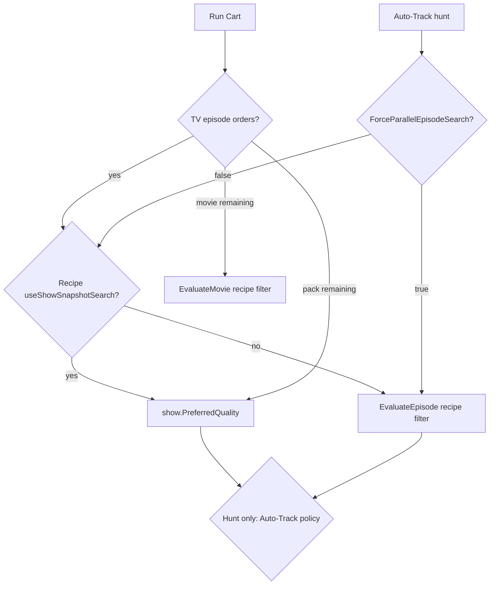

# 02 — Conflict map (who wins)

Quality/seeders/audio **allow lists** only. Scoring weights and max-candidate caps are recipe `extensionData` on all paths below unless noted.

---

## TV episode — Run Cart (batch)

Entry: [`TorrentWorkspaceViewModel.SearchEpisodeOrdersAsync`](../../ViewModels/TorrentWorkspaceViewModel.cs) → [`FetchJobService.FetchEpisodeCandidatesAsync`](../../Services/FetchJobService.cs).

Does **not** call `AutomationFlowService.DryRunEpisodeAsync`.

| Recipe `useShowSnapshotSearch` | Matcher | Quality / seeders / exclude terms |
|-------------------------------|---------|-------------------------------------|
| **True** (Breaking Bad High Quality recipe) | `SnapshotCandidateMatcher` | **Show** `PreferredQuality`, `MinimumSeeders`. No recipe exclude terms / min seeders / quality list. Scoring weights + prefer-terms **from recipe**. |
| **False** | `SearchEpisodeCandidatesSequentialAsync` → `EvaluateEpisode` | **Recipe** Candidate Filter (quality, seeders, size, include/exclude, groups). |

Snapshot is the path that hid 2160p.

`SearchOrderAsync` still contains a `DryRunAsync` TV episode branch. Normal Run Cart never reaches it for episodes (they are batched first). Retry of an episode order also goes through `SearchEpisodeOrdersAsync`.

---

## TV episode — Auto-Track hunt

Entry: [`AutoTrackService.RunFetchAndAddPhaseAsync`](../../Services/AutoTrackService.cs) with `EpisodeFetchOptions.ForceParallelEpisodeSearch = settings.Search.ForceParallelEpisodeSearch`.

[`FetchJobService`](../../Services/FetchJobService.cs): if Force Parallel is **true**, snapshot is **off** regardless of recipe.

| Live `settings.json` | Effect on this machine |
|----------------------|------------------------|
| `ForceParallelEpisodeSearch: false` | Hunt uses recipe snapshot flag → **same leftover quality gate** as cart snapshot |
| If user enables Force Parallel | Hunt uses `EvaluateEpisode` → **recipe** quality; cart snapshot still leftover |

After any matcher, hunt applies [`AutoTrackCandidatePolicyService`](../../Services/AutoTrackCandidatePolicyService.cs). That cannot resurrect 2160p already dropped by `PreferredQuality`.

---

## TV season pack — Run Cart

[`FetchJobService.FetchSeasonPacksAsync`](../../Services/FetchJobService.cs) → `GetPackRejectReason(..., ParseQualities(show.PreferredQuality))`.

Always leftover show quality. Pack recipe filter list is not the pack quality gate.

---

## Movie — Run Cart

[`SearchOrderAsync`](../../ViewModels/TorrentWorkspaceViewModel.cs) → `DryRunMovieAsync` → `EvaluateMovie`.

Always **recipe** filter. Movie `PreferredQuality` unused.

---

## Recipe workspace / dry-run

[`AutomationFlowService.DryRunAsync`](../../Services/AutomationFlowService.cs) always uses `CandidateEvaluationService`. Full `WriteRecipeEvaluation` debug. This is why older movie `cart-debug` files list every ACCEPT/REJECT.

---

## Winner table

| Flow | Quality allow list winner | Leftover column involved? |
|------|---------------------------|---------------------------|
| Movie cart | Recipe filter | No |
| TV cart, parallel | Recipe filter | No |
| TV cart, snapshot | **Show `PreferredQuality`** | **Yes** |
| TV pack cart | **Show `PreferredQuality`** | **Yes** |
| Hunt, force parallel | Recipe filter, then Auto-Track policy | Prefs no; Auto-Track yes (policy) |
| Hunt, snapshot (live default) | **Show `PreferredQuality`**, then Auto-Track policy | **Yes**, then Auto-Track |
| Recipe dry-run | Recipe filter | No |
