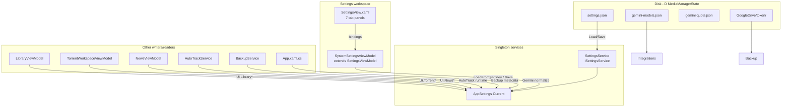

# Current Settings Architecture

## High-level diagram



## Workspace vs section naming

| Name in code | What it actually is |
|--------------|---------------------|
| `SystemSettingsViewModel` | **Entire Settings workspace** VM (all 7 tabs) |
| `SystemSettingsView.xaml` | Host that embeds `SettingsView` |
| `SettingsSection.System` | **One tab** inside the workspace (storage, logs, startup, theme) |
| `SettingsViewModel` | Base class holding **all** section state |

**Trap:** Planning docs say "SystemSettingsSectionViewModel" for the System tab — must not reuse `SystemSettingsViewModel` (workspace).

## Lifecycle

### App startup (`App.xaml.cs`)

1. Build DI container
2. `ISettingsService.Load()` — read `{StateFolder}/settings.json`
3. `EnsureDefaults()` — migrations, clamps
4. `NormalizeGeminiSettings()` — catalog normalize (memory only until next Save)
5. `ThemeService.Apply()`
6. `DatabaseService.Initialize(StateFolder)`

### Open Settings workspace

1. `MainViewModel` navigates to `SystemSettingsViewModel`
2. `OnNavigatedTo()` → `_settingsService.Load()` + `LoadFromSettings()`
3. Reloads **from disk every visit** (Sprint 4); no dirty prompt yet (Sprint 6)

### User clicks Save

1. `SettingsViewModel.Save()` writes VM fields → `Current` via many `Apply*` methods
2. `_settingsService.Save()` serializes **entire** `Current` atomically
3. Side effects: Windows startup registry, theme, DB re-init if StateFolder changed, tray init

## SettingsService responsibilities

| Method | Role |
|--------|------|
| `Load()` | Deserialize JSON; `EnsureDefaults()`; bootstrap log to `{StateFolder}/settings-load.log` |
| `Save()` | Lock; `EnsureDefaults()`; write `settings.json.tmp` → move |
| `EnsureDefaults()` | **Single normalization hub** — clamps, legacy migration, forced `LibraryRootMode = AutoPerDrive` |

**Design note:** Normalization runs on **both** load and save. UI `Apply*` methods **duplicate** some clamps (e.g. log retention) — two layers of validation.

## SettingsViewModel responsibilities (today)

| Concern | Count (approx.) |
|---------|-----------------|
| `[ObservableProperty]` fields | ~80+ |
| `[RelayCommand]` methods | ~40+ |
| `Apply*` private methods | 10 |
| Constructor dependencies | 18 services |

Everything for all tabs lives in one type. Section switch is **only** `SelectedSettingsSection` + XAML visibility triggers — no separate objects.

## External persistence (not in settings.json)

| Asset | Path | Used by tab |
|-------|------|-------------|
| Gemini model catalog | `{StateFolder}/gemini-models.json` | Integrations |
| Gemini quota state | `{StateFolder}/gemini-quota.json` | Integrations (display) |
| Google OAuth token | `{StateFolder}/GoogleDrive/token/` | Backup |
| OAuth client JSON | user-selected or default `{StateFolder}/GoogleDrive/credentials.json` | Backup |

## DI registration (`App.xaml.cs`)

```csharp
services.AddSingleton<ISettingsService, SettingsService>();
// ...
services.AddSingleton<SystemSettingsViewModel>();  // workspace, not "System tab"
```

No section VMs registered today.
