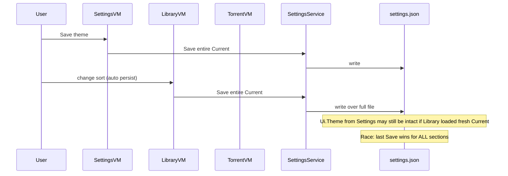

# Save / Load / Apply — Problem Catalog

This document records **behavioral bugs and design debt** in the current settings mechanism — not necessarily user-visible bugs today, but **split landmines**.

## The three layers (confused today)

| Layer | What it should mean | What happens today |
|-------|---------------------|-------------------|
| **VM properties** | UI editing buffer | Same names as JSON fields, scattered prefixes |
| **`Apply*()`** | VM → `Current` projection | Coarse-grained; one Apply spans multiple UI tabs |
| **`SettingsService.Save()`** | `Current` → disk | Whole-file serialize; also runs `EnsureDefaults()` again |

There is **no** clear rule: "VM owns draft; Current owns committed; disk owns persisted."

---

## Save() pipeline (monolithic)

From `SettingsViewModel.Save()` (lines 499–536):

```
Direct writes: StateFolder, SourceFolders, LibraryRootMode, DefaultLibraryFolderName, TmdbReadAccessToken
ApplyGeminiSettings()
ApplyAutoTorrentSettings()      ← Integrations qBit + Torrent Storage
ApplyWarpSettings()             ← Integrations WARP
ApplyLogSettings()
ApplyStartupSettings()
ApplyAutoTrackSettings()        ← Auto-Track + Integrations Jellyfin creds
ApplyUiSettings()               ← Theme ONLY
ApplySymlinkSettings()
ApplyNotificationSettings()
ApplyBackupSettings()
_settingsService.Save()
→ Windows startup, theme, DB init, tray, status message
```

**Problem:** Saving from any tab persists **all** sections. Unvisited tabs still push VM → Current. Without dirty tracking, user cannot know what will be written.

---

## Apply* granularity mismatch

| Apply method | UI tabs fed | JSON roots |
|--------------|-------------|------------|
| `ApplyGeminiSettings` | Integrations | `Gemini` |
| `ApplyAutoTorrentSettings` | Integrations + Torrent Storage | `AutoTorrent` |
| `ApplyWarpSettings` | Integrations | `Warp` |
| `ApplyAutoTrackSettings` | Auto-Track + Integrations | `AutoTrack` |
| Others | 1:1 with tab | matching root |

**Split implication:** Extracting `IntegrationsSettingsSectionViewModel` requires either:

- Splitting `ApplyAutoTorrentSettings` into `ApplyQbittorrentConnection` + `ApplyTorrentStorage`, **or**
- Keeping shared `AutoTorrent` state in a parent coordinator both sections read.

Same for Jellyfin: `ApplyJellyfinConnection` vs `ApplyJellyfinRefreshBehavior` both touch `AutoTrack.Jellyfin`.

---

## Live in-memory mutation without Save

| Trigger | What mutates `Current` | Persisted? |
|---------|------------------------|------------|
| `OnWarpExecutablePathChanged` | Full `Warp` via `ApplyWarpSettings()` | Only after Save |
| `RefreshLibraryRootPreview()` | `DefaultLibraryFolderName` normalized | Only after Save |
| `LoadFromSettings()` | `Backup ??= new BackupSettings()` | Only after Save |
| Test qBit connection | `ApplyAutoTorrentSettings()` | Only after Save — **but overwrites other AutoTorrent fields from VM** |
| `App.xaml.cs` Gemini normalize | Gemini model/fallbacks | Only after Save |

These make **"reload on navigate"** (Sprint 4) dangerous combined with unsaved edits (Sprint 6 dirty prompt not yet implemented):

- User edits Torrent folder (unsaved)
- Navigates away and back → `Load()` from disk OK
- User clicks Test qBit on Integrations → `ApplyAutoTorrentSettings()` may reset in-memory AutoTorrent from VM bindings that were reloaded — confusing but not always wrong

---

## LoadFromSettings asymmetry

**Loaded but Apply write-back incomplete** (`ApplyAutoTrackSettings` clamps some fields back to VM, not all):

- `AutoTrackMinQuality`, file size fields, `AutoTrackAllowedQualities`, `AutoTrackForceParallelEpisodeSearch` — written to JSON on save but not re-normalized into VM after clamp in Apply.

**Saved but never loaded in Settings VM:**

- `LibraryRootMode` (always forced on save anyway)

**Loaded in VM but saved elsewhere:**

- All `Ui.Library*`, `Ui.Torrent*`, `Ui.News*` — workspace VMs own these

---

## Dual (quad) writer problem on UiSettings



Any modernization must decide: **Is `Ui` workspace state "settings" or "session UI state"?** Today it lives in the same file as secrets and AutoTrack policy.

---

## Partial Save anti-pattern (Backup)

`ConnectGoogleDrive` and `BackupNow`:

1. `ApplyBackupSettings()`
2. `_settingsService.Save()` — **full file**

If user had unsaved edits in other tabs (once dirty tracking exists), this would persist or discard unpredictably. Today everything is in one VM so in-memory is consistent — still writes unrelated sections to disk.

---

## Test vs Save mental model

UI copy says: *"Save settings to persist"* after successful tests.

Implementation: tests call `Apply*` → update `Current` in memory → services read `Current` → disk unchanged until Save.

**Exception:** Backup connect saves immediately.

Document this explicitly for future section VMs so test commands don't accidentally call full-file Save.

---

## Normalization duplicated

| Field | Clamped in EnsureDefaults | Also clamped in Apply* |
|-------|---------------------------|------------------------|
| Log max lines / retention | Yes | Yes (`ApplyLogSettings`) |
| Warp timeout | Yes | Yes (`ApplyWarpSettings`) |
| Backup schedule | Yes | Yes (`ApplyBackupSettings`) |
| AutoTrack intervals | Yes | Yes (`ApplyAutoTrackSettings`) |

Not wrong, but split sections must call shared normalization helpers — DRY with `SettingsService` or extract `SettingsNormalizer` in Core.

---

## Recommended hygiene (pre-split, low risk)

1. **Preview methods must not write `Current`** — compute preview from VM fields only.
2. **Remove live `ApplyWarpSettings` on property change** — apply only on Save or explicit test.
3. **Split `ApplyAutoTorrentSettings`** into connection vs storage (internal refactor, same public Save).
4. **Split `ApplyAutoTrackSettings`** into schedule/quality vs Jellyfin connection vs Jellyfin refresh.
5. **Document Backup partial Save** — intentional; optionally narrow to Backup-only serializer later.

These are **refactors**, not user-facing feature changes — good "Sprint 4.5" before VM split.

---

## Sprint 6 dirty-tracking interaction

Planned: prompt if `OnNavigatedTo` would clobber unsaved edits.

**Blockers from this audit:**

- Multiple writers (`LibraryViewModel`, etc.) save disk without Settings VM knowing → dirty flag on Settings host is **insufficient** for global consistency.
- Live Apply on WARP path means "dirty" might already be partially in `Current` but not on disk.
- Backup partial Save bypasses dirty prompt entirely.

Dirty-tracking design must scope to **Settings workspace draft** vs **committed Current** vs **disk** — three states, not a bool.
