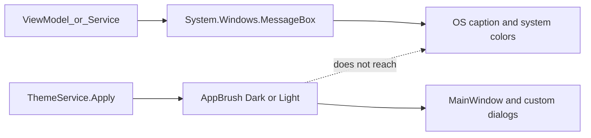

# 00 — Executive summary

**Status:** Helper implemented (`AppMessageBox`). Inventory of the 26 former Win32 call sites still applies, plus the cart **Already in qBittorrent** confirm (27 `AppMessageBox` sites).

## Symptom

From Library (or News), **Open in Jellyfin** when the server is down:

- App workspace stays on the themed Dark/Light chrome (`AppBrushCanvas`, custom caption).
- A **stock Windows** dialog appears: caption **Jellyfin**, yellow warning icon, body *Could not reach Jellyfin. Check that it is running and the base URL is correct.*
- The box does not follow [`ThemeService`](../../Services/ThemeService.cs). Light OS chrome on a dark app (or the reverse) is expected with the current API.

That string is produced by [`JellyfinMediaNavigationService.FormatUserMessage`](../../Services/JellyfinMediaNavigationService.cs). The service **does not** show a dialog. Hosts are [`LibraryViewModel.ShowJellyfinNavigationError`](../../ViewModels/LibraryViewModel.cs) and [`NewsViewModel.OpenEpisodeInJellyfin`](../../ViewModels/NewsViewModel.cs).

## Root cause (one gate)

`System.Windows.MessageBox.Show` maps to Win32 `MessageBoxEx`. Caption, buttons, and `MessageBoxImage` are owned by the OS, not by `AppBrush*` resource dictionaries.

The rest of the app already themes windows:

| Surface | Chrome | Colors |
|---------|--------|--------|
| [`MainWindow.xaml`](../../MainWindow.xaml) | `WindowStyle="None"` + `WindowChrome` | `AppBrushCanvas` |
| [`WebViewerWindow.xaml`](../../Views/WebViewerWindow.xaml) | Same custom chrome | `AppBrushCanvas` |
| [`EnginePickerDialog.xaml`](../../Views/EnginePickerDialog.xaml) | Standard WPF `Window`, themed body | `AppBrushCanvas` / `AppBrushText` |
| `MessageBox.Show` | OS caption bar | System colors |

## Scale

| | |
|--|--|
| Files with `MessageBox.Show` | **14** |
| Call sites | **27** |
| WinForms `MessageBox` | **None** |
| WPF-UI / Material `ContentDialog` | **None** |

Four **services** own a box. Ten other files are ViewModels, view code-behind, or boot.

| Layer | File | Count |
|-------|------|-------|
| Boot | [`App.xaml.cs`](../../App.xaml.cs) | 1 |
| Service | [`DatabaseService`](../../Services/DatabaseService.cs) | 1 |
| Service | [`JellyfinViewerService`](../../Services/JellyfinViewerService.cs) | 1 |
| Service | [`QbittorrentViewerService`](../../Services/QbittorrentViewerService.cs) | 1 |
| Service | [`GeminiLinkConfirmationService`](../../Services/Gemini/GeminiLinkConfirmationService.cs) | 1 |
| VM | [`LibraryViewModel`](../../ViewModels/LibraryViewModel.cs) | 8 |
| VM | [`NewsViewModel`](../../ViewModels/NewsViewModel.cs) | 1 |
| VM | [`MainViewModel`](../../ViewModels/MainViewModel.cs) | 1 |
| VM | [`SettingsViewModel`](../../ViewModels/SettingsViewModel.cs) | 1 |
| VM | [`TorrentWorkspaceViewModel`](../../ViewModels/TorrentWorkspaceViewModel.cs) | 6 |
| VM | [`RecipeWorkspaceViewModel`](../../ViewModels/RecipeWorkspaceViewModel.cs) | 1 |
| View | [`SetAutoTrackDialog`](../../Views/SetAutoTrackDialog.xaml.cs) | 2 |
| View | [`EpisodeOrganizationDialog`](../../Views/EpisodeOrganizationDialog.xaml.cs) | 1 |
| View | [`EnginePickerDialog`](../../Views/EnginePickerDialog.xaml.cs) | 1 |

Full rows: [01-call-site-inventory.md](./01-call-site-inventory.md).

## Theme apply vs boot dialogs

From [`App.xaml.cs`](../../App.xaml.cs) `OnStartup`:

1. **Single-instance** `MessageBox` — before DI and before `IThemeService.Apply`. [`App.xaml`](../../App.xaml) already merges `AppThemeColors.Light.xaml`, so a later helper can still bind `AppBrush*` here.
2. `IThemeService.Apply(settings.Current.Ui?.Theme ?? AppTheme.Light)` — swaps Dark/Light dictionaries.
3. `IDatabaseService.Initialize` — **migration failure** box runs after Apply, still on the UI thread.

All 27 current callers are UI-thread. Dispatcher marshal is a safety rule for a later helper, not a live bug.

## What this pack is for

Map every Win32 box so a later code plan can add **one** themed helper window (`AppBrush*` + custom chrome) and replace the 26 sites **without changing copy or default results**.

Do not treat this folder as a green light to implement UI.
